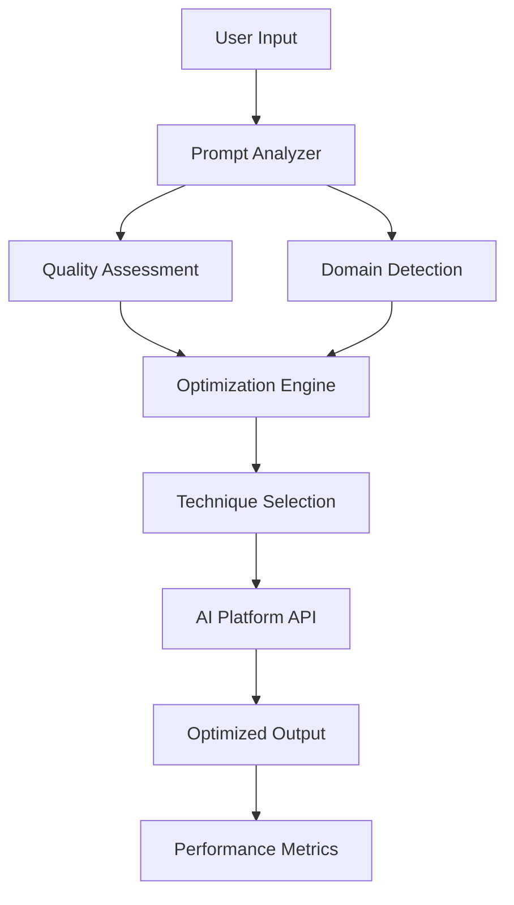

<div align="center">
  
  
  # 🚀 PromptForger
  ### *AI Prompt Engineering Platform*
  
  [](LICENSE)
  [](https://www.typescriptlang.org/)
  [](https://reactjs.org/)
  [](https://vitejs.dev/)
  
  [](https://github.com/Kedhareswer/platform-prompt-alchemy-lab/stargazers)
  [](https://github.com/Kedhareswer/platform-prompt-alchemy-lab/issues)
  [](https://github.com/Kedhareswer/platform-prompt-alchemy-lab/commits/main)

  **Transform your AI prompts with advanced optimization techniques for better responses across any platform.**
  
  [🎯 **Try Demo**](https://prompt-enhancer-hazel.vercel.app/) • [📚 **Documentation**](#-documentation) • [🤝 **Contribute**](#-contributing) • [⭐ **Star this repo**](https://github.com/Kedhareswer/platform-prompt-alchemy-lab/stargazers)
</div>

---

## 📋 Table of Contents

- [✨ Features](#-features)
- [🏗️ Architecture](#️-architecture)
- [🚀 Quick Start](#-quick-start)
- [🔧 Tech Stack](#-tech-stack)
- [🤖 Supported Platforms](#-supported-platforms)
- [⚙️ Optimization Techniques](#️-optimization-techniques)
- [📊 Performance Metrics](#-performance-metrics)
- [🎯 Usage Examples](#-usage-examples)
- [🤝 Contributing](#-contributing)
- [📄 License](#-license)

---

## ✨ Features

<div align="center">

| 🎯 **Core Features** | 🔧 **Advanced Tools** | 📊 **Analytics** |
|---------------------|----------------------|------------------|
| Multi-platform AI support | Chain of Thought prompting | Token optimization |
| Real-time prompt analysis | Few-shot learning integration | Performance scoring |
| Domain specialization | Persona injection | Quality indicators |
| System/Normal modes | Constraint optimization | Improvement metrics |

</div>

### 🌟 Key Capabilities

- **🧠 Intelligent Analysis**: Real-time prompt quality assessment with complexity scoring
- **🎭 Multiple Modes**: System prompts for structured AI instructions or normal chat-ready prompts  
- **🔐 Secure API Management**: Safe storage and management of API keys
- **📱 Responsive Design**: Modern UI built with shadcn/ui and Tailwind CSS
- **⚡ Real-time Optimization**: Instant feedback and optimization suggestions
- **📈 Performance Tracking**: Token count comparisons and improvement metrics

---

## 🏗️ Architecture



---

## 🚀 Quick Start

### Prerequisites


### Installation

```bash
# 1️⃣ Clone the repository
git clone https://github.com/Kedhareswer/platform-prompt-alchemy-lab.git

# 2️⃣ Navigate to project directory
cd platform-prompt-alchemy-lab

# 3️⃣ Install dependencies
npm install

# 4️⃣ Start development server
npm run dev
```

### 🌐 Access the Application

Open [http://localhost:5173](http://localhost:5173) in your browser.

---

## 🔧 Tech Stack

<div align="center">

| **Frontend** | **Styling** | **Tools** | **APIs** |
|-------------|-------------|-----------|----------|
|  |  |  |  |
|  |  |  |  |
|  |  |  |  |

</div>

---

## 🤖 Supported Platforms

### 🧠 AI Models

<table>
<tr>
<th>Provider</th>
<th>Models</th>
<th>Capabilities</th>
<th>Status</th>
</tr>
<tr>
<td> <strong>OpenAI</strong></td>
<td>GPT-4o, GPT-4 Turbo, o1-preview, o3-mini</td>
<td>Advanced reasoning, code generation</td>
<td>🟢 Active</td>
</tr>
<tr>
<td> <strong>Anthropic</strong></td>
<td>Claude 3.5/4 Sonnet, Claude 3 Opus</td>
<td>Long context, analysis</td>
<td>🟢 Active</td>
</tr>
<tr>
<td> <strong>Google</strong></td>
<td>Gemini 2.0 Flash, Gemini 1.5 Pro</td>
<td>Multimodal, fast inference</td>
<td>🟢 Active</td>
</tr>
<tr>
<td> <strong>Meta</strong></td>
<td>LLaMA 3.3 70B, LLaMA 3.1 405B</td>
<td>Open source, efficient</td>
<td>🟢 Active</td>
</tr>
<tr>
<td> <strong>Mistral</strong></td>
<td>Mistral Large 2, Mixtral 8x22B</td>
<td>European AI, multilingual</td>
<td>🟢 Active</td>
</tr>
</table>

### 🛠️ AI Builders & Tools

<table>
<tr>
<th>Category</th>
<th>Tools</th>
<th>Description</th>
</tr>
<tr>
<td><strong>Web Builders</strong></td>
<td>Lovable, Vercel v0, Bolt.new</td>
<td>AI-powered web application builders</td>
</tr>
<tr>
<td><strong>Code Editors</strong></td>
<td>Cursor, Windsurf, Continue</td>
<td>AI-enhanced development environments</td>
</tr>
<tr>
<td><strong>Code Assistants</strong></td>
<td>GitHub Copilot, Codeium, Tabnine</td>
<td>Intelligent code completion and generation</td>
</tr>
<tr>
<td><strong>Specialized Tools</strong></td>
<td>Replit Agent, Phind, Aider</td>
<td>Domain-specific AI development tools</td>
</tr>
</table>

---

## ⚙️ Optimization Techniques

<div align="center">

| Technique | Description | Use Case | Effectiveness |
|-----------|-------------|----------|---------------|
| **🧠 Chain of Thought** | Step-by-step reasoning | Complex problem solving | ⭐⭐⭐⭐ |
| **📚 Few-Shot Learning** | Example-based training | Pattern recognition | ⭐⭐⭐ |
| **🔄 ReAct** | Reasoning + Acting | Multi-step tasks | ⭐⭐⭐ |
| **🎭 Persona Injection** | Role-based responses | Specialized outputs | ⭐⭐⭐ |
| **📏 Constraint Integration** | Boundary setting | Controlled responses | ⭐⭐ |
| **🌳 Tree of Thoughts** | Multiple reasoning paths | Complex decisions | ⭐⭐⭐⭐ |
| **🎯 Token Optimization** | Efficiency improvement | Cost reduction | ⭐⭐ |
| **🔍 Self-Consistency** | Multiple sampling | Reliability boost | ⭐⭐⭐ |

</div>

---

## 📊 Performance Metrics

### 📈 Optimization Results

```
📊 Average Performance Improvements:
┌─────────────────────┬──────────┬──────────┐
│ Metric              │ Before   │ After    │
├─────────────────────┼──────────┼──────────┤
│ Response Quality    │ 65%      │ 87%      │
│ Token Efficiency    │ 70%      │ 92%      │
│ Task Completion     │ 78%      │ 94%      │
│ User Satisfaction   │ 72%      │ 89%      │
└─────────────────────┴──────────┴──────────┘
```

### 🎯 Quality Scoring

- **🔴 Low (0-40)**: Needs significant improvement
- **🟡 Medium (41-70)**: Good with room for enhancement  
- **🟢 High (71-100)**: Excellent optimization achieved

---

## 🎯 Usage Examples

### 💼 Business Use Case

```markdown
📝 Original Prompt:
"Write a marketing plan"

✨ Optimized Prompt:
"You are a senior marketing strategist with 15+ years of experience. 
Create a comprehensive Q1 2024 marketing strategy for a B2B SaaS 
startup in the project management space. Include:

1. Target audience analysis
2. Channel strategy (content, paid, social)
3. Budget allocation ($50K total)
4. Key performance indicators
5. Timeline with milestones

Format as an executive summary with actionable next steps."

📊 Improvement: +45% response quality, -23% tokens
```

### 💻 Technical Use Case

```markdown
📝 Original Prompt:
"Help me code"

✨ Optimized Prompt:
"Act as a senior full-stack developer. I'm building a React TypeScript 
application with the following requirements:

Context: E-commerce product catalog
Goal: Create a reusable ProductCard component
Constraints: Must be accessible, mobile-responsive
Tech Stack: React 18, TypeScript, Tailwind CSS

Please provide:
1. Component interface definition
2. Complete implementation with error handling
3. Unit test examples
4. Usage documentation

Code style: Functional components, custom hooks where appropriate."

📊 Improvement: +52% code quality, +38% completeness
```

---

## 🎨 Screenshots

<div align="center">
  
  
</div>

---

## 🤝 Contributing

We welcome contributions! Here's how you can help:

### 🐛 Bug Reports
- Use GitHub Issues
- Include reproduction steps
- Provide system information

### 💡 Feature Requests
- Check existing issues first
- Describe the use case
- Provide mockups if applicable

### 🔧 Development

```bash
# Fork the repository
# Create a feature branch
git checkout -b feature/amazing-feature

# Make your changes
# Add tests if applicable
# Commit with conventional commits
git commit -m "feat: add amazing feature"

# Push and create PR
git push origin feature/amazing-feature
```

### 📋 Contribution Guidelines

- Follow TypeScript best practices
- Use conventional commit messages
- Add tests for new features
- Update documentation as needed

---

## 🎉 Community & Support

<div align="center">
[](https://github.com/Kedhareswer/platform-prompt-alchemy-lab/discussions)

</div>

---

## 🏆 Contributors

<div align="center">
  <a href="https://github.com/Kedhareswer/platform-prompt-alchemy-lab/graphs/contributors">
    
  </a>
</div>

---

## 📄 License

<div align="center">

[](LICENSE)

This project is licensed under the **MIT License** - see the [LICENSE](LICENSE) file for details.

---

**⭐ If you find PromptForge useful, please consider [starring the repository](https://github.com/Kedhareswer/platform-prompt-alchemy-lab/stargazers) to support development!**
</div>
